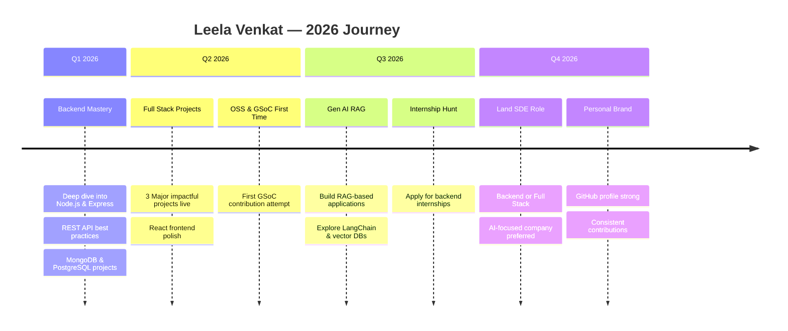

<!-- ```markdown -->
<!-- ============================================================ -->
<!--           ANIMATED HEADER - LEELA VENKAT                     -->
<!-- ============================================================ -->

<div align="center">


</div>

<!-- TYPING ANIMATION -->
<div align="center">
  
</div>

<br/>

<!-- BADGES ROW -->
<div align="center">

[](https://github.com/leelavenkat12)
[](https://github.com/leelavenkat12)
[](https://github.com/leelavenkat12)
[](https://www.linkedin.com/in/t-venkat-458a6931b)

</div>

<br/>

<!-- DIVIDER -->


---

<!-- ============================================================ -->
<!--                    ABOUT ME SECTION                          -->
<!-- ============================================================ -->

##  &nbsp; `whoami`

<div align="center">
  
</div>

```bash
┌──(leela㉿universe)-[~/about-me]
└─$ cat profile.json
```

```json
{
  "name": "Leela Venkat",
  "role": "Backend Dev | Full Stack | Gen AI RAG | Anthropist",
  "university": "Marwadi University",
  "location": "India 🇮🇳",
  "focus": ["Backend Systems", "Full Stack", "Gen AI RAG"],
  "currentBuild": "Learning backend and building 3 major impactful projects",
  "goal2026": "Land SDE Role + One Internship + OSS Contribution + Being Consistent for GSoC first time",
  "funFact": "I write code like poetry — sometimes it rhymes, sometimes it just crashes 😄",
  "available": true,
  "coffee": "SELECT * FROM coffee WHERE consumed = TRUE; -- ∞ rows"
}
```

<br/>

<!-- ANIMATED SKILL BARS / INFO GRID -->
<table align="center">
<tr>
<td>

**🎯 Current Focus**

```
Backend Systems            ████████░░  80%
React & Full Stack         ██████░░░░  60%
Gen AI / RAG               █████░░░░░  50%
Open Source / GSoC         ███░░░░░░░  30%
```

</td>
<td>

**⚡ Quick Stats**

```
🔥 Coding Since    →  2023
📦 Projects Built  →  3+
💾 GitHub Repos    →  Growing
☕ Coffee Cups/Day →  ∞
🌟 Favourite Stack →  Node.js & React
🎯 Next Milestone  →  SDE Role 2026
```

</td>
</tr>
</table>

---


<!-- ============================================================ -->
<!--                    TECH STACK SECTION                        -->
<!-- ============================================================ -->

## ⚡ `TECH STACK`

<div align="center">

### 🖥️ Languages


### 🌐 Frontend Development


### ⚙️ Backend Development


### 🗄️ Databases & Storage


### ☁️ Cloud & DevOps


### 🛠️ Tools & IDE


</div>

---


<!-- ============================================================ -->
<!--                    BUILD PRINCIPLES                         -->
<!-- ============================================================ -->

## :: BUILD PRINCIPLES

<table align="center">
<tr>
<td width="33%" valign="top">

<strong>Reliability First</strong>

<pre>
- Defensive inputs
- Clear fallbacks
- Observable logs
</pre>

</td>
<td width="33%" valign="top">

<strong>Scale With Calm</strong>

<pre>
- Stateless services
- Cache before compute
- Async for heavy work
</pre>

</td>
<td width="33%" valign="top">

<strong>Clarity Wins</strong>

<pre>
- Name things well
- Small, testable units
- Predictable flows
</pre>

</td>
</tr>
</table>

---


<!-- ============================================================ -->
<!--                    NOW / NEXT / LATER                        -->
<!-- ============================================================ -->

## :: NOW / NEXT / LATER

<table align="center">
<tr>
<td width="33%" valign="top">

<strong>NOW</strong>

<pre>
- Learning Backend deeply
- Building React projects
- 3 major impactful projects
</pre>

</td>
<td width="33%" valign="top">

<strong>NEXT</strong>

<pre>
- Coming Soon 🚧
</pre>

</td>
<td width="33%" valign="top">

<strong>LATER</strong>

<pre>
- Coming Soon 🚧
</pre>

</td>
</tr>
</table>

---


<!-- ============================================================ -->
<!--                    SYSTEM DESIGN CANVAS                      -->
<!-- ============================================================ -->

## :: SYSTEM DESIGN CANVAS

```text
[Client] -> [Edge] -> [API] -> [Workers] -> [Data] -> [Signals]
```

**Design checks:**

- Latency budget is explicit
- Failure paths are mapped
- Data ownership is clear
- Cost grows predictably
- Metrics are actionable

---


<!-- ============================================================ -->
<!--                  FEATURED PROJECTS                           -->
<!-- ============================================================ -->

## 🚀 `FEATURED PROJECTS`

<div align="center">

<!-- PROJECT CARD -->
<a href="https://github.com/leelavenkat12">

</a>

</div>

<br/>

<table align="center">

<!-- ROW 1 -->
<tr>

<td width="50%">

### 🔧 Project 1 — Coming Soon

> **Backend + Full Stack Project**

```
🔧 Stack:  Node.js | Express.js | MongoDB
           React | PostgreSQL
⚡ Status: In Development 🔄
🌐 Deploy: Render / Vercel
```

**Key Features:**

- 🚧 Coming Soon

[](https://github.com/leelavenkat12)

</td>

<td width="50%">

### 🧠 Project 2 — Coming Soon

> **Gen AI / RAG Project**

```
🔧 Stack:  Node.js | Express.js | MongoDB
           React | Gen AI / RAG
⚡ Status: In Planning 🔄
🌐 Deploy: Coming Soon
```

**Key Features:**

- 🚧 Coming Soon

[](https://github.com/leelavenkat12)

</td>

</tr>

<!-- ROW 2 -->
<tr>

<td width="50%">

### 🚀 Project 3 — Coming Soon

> **Impactful Full Stack Project**

```
🔧 Stack:  Node.js | Express.js | PostgreSQL
           React | REST API
⚡ Status: In Planning 🔄
🌐 Deploy: Render / Vercel
```

**Key Features:**

- 🚧 Coming Soon

[](https://github.com/leelavenkat12)

</td>

<td width="50%">

### 🌱 More Projects — Coming Soon

> **Exploring Backend & React**

```
🔧 Stack:  Currently Exploring...
⚡ Status: Coming Soon 🔄
```

**Planned:**

- 🎯 Backend APIs
- 🖥️ React Apps
- 📦 Gen AI RAG experiments
- 🤖 GSoC contributions

[](https://github.com/leelavenkat12)

</td>

</tr>

</table>

---


<!-- ============================================================ -->
<!--                  GITHUB ANALYTICS                            -->
<!-- ============================================================ -->

## 📊 `GITHUB ANALYTICS`

<div align="center">


</div>

<div align="center">


</div>

<br/>

<div align="center">
  
</div>

---


<!-- ============================================================ -->
<!--                     2026 ROADMAP                             -->
<!-- ============================================================ -->

## 🗺️ `2026 ROADMAP`

<div align="center">



</div>

---


<!-- ============================================================ -->
<!--                   ACHIEVEMENTS                               -->
<!-- ============================================================ -->

## 🏆 `ACHIEVEMENTS & MILESTONES`

<div align="center">

<table>
<tr>
<td align="center">


</td>
<td align="center">


</td>
<td align="center">


</td>
</tr>
<tr>
<td align="center">


</td>
<td align="center">


</td>
<td align="center">


</td>
</tr>
</table>

</div>

<br/>

<!-- TROPHY SHOWCASE -->
<div align="center">
  
</div>

---


<!-- ============================================================ -->
<!--                   CURRENTLY EXPLORING                        -->
<!-- ============================================================ -->

## 📖 `CURRENTLY EXPLORING`

<div align="center">

<table>
<tr>
<td align="center" width="25%">


<br/><strong>React.js</strong>
<br/><sub>Frontend Development</sub>

</td>
<td align="center" width="25%">


<br/><strong>Node.js & Express</strong>
<br/><sub>Backend Systems</sub>

</td>
<td align="center" width="25%">


<br/><strong>Gen AI / RAG</strong>
<br/><sub>AI-Powered Apps</sub>

</td>
<td align="center" width="25%">


<br/><strong>System Design</strong>
<br/><sub>Scalable Architecture</sub>

</td>
</tr>
</table>

</div>

---


<!-- ============================================================ -->
<!--                  CONNECT WITH ME                             -->
<!-- ============================================================ -->

## 📡 `CONNECT WITH ME`

<div align="center">

<a href="https://github.com/leelavenkat12">
  
</a>
&nbsp;
<a href="https://www.linkedin.com/in/t-venkat-458a6931b">
  
</a>
&nbsp;
<a href="mailto:venkatleela95@gmail.com">
  
</a>

</div>

<br/>

<div align="center">

> 💡 **"The best code is the code that solves real problems for real people."**
>
> 🤝 Open to **collaborations**, **internships**, and **GSoC contributions**
>
> 📧 Always happy to discuss **backend, full stack, Gen AI RAG** or just **say hi!**

</div>

---

<!-- FOOTER -->
<div align="center">


</div>

<div align="center">

```
╔══════════════════════════════════════════════════════╗
║     THANKS FOR VISITING MY DIGITAL SPACE! 🚀         ║
║     Let's build something amazing together! ⚡        ║
║          — LEELA VENKAT © 2026 —                     ║
╚══════════════════════════════════════════════════════╝
```


</div>
